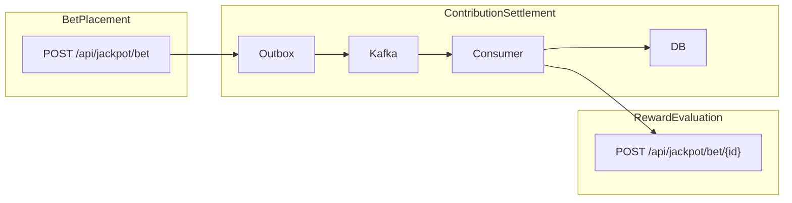

# SLO / SLI — jackpot-service

Service Level Indicators (SLI) and Objectives (SLO) for jackpot-service, following
[Site Reliability Engineering](https://sre.google/sre-book/service-level-objectives/),
[The Site Reliability Workbook](https://sre.google/workbook/implementing-slos/), and
[Building Secure & Reliable Systems](https://sre.google/books/).

## Service overview

jackpot-service accepts bets, publishes them to Kafka, processes jackpot pool contributions
asynchronously, and evaluates bets for jackpot rewards.

### User journeys

| Journey | Description | Entry point |
|---------|-------------|-------------|
| **BetPlacement** | User submits a bet and receives acceptance | `POST /api/jackpot/bet` |
| **ContributionSettlement** | Accepted bet contributes to the matching jackpot pool | Outbox → Kafka → consumer |
| **RewardEvaluation** | User checks whether a contributing bet wins the jackpot | `POST /api/jackpot/bet/{betId}` |



## SLI definitions and SLO targets

Rolling window: **30 days**. Error budget = `1 - SLO`.

### Journey 1: Bet Placement

| SLI | Definition | SLO |
|-----|------------|-----|
| **Availability** | Ratio of non-server-error responses. `2xx` and `4xx` (validation, duplicate bet, unknown jackpot) are good; `5xx` are bad. | **99.9%** |
| **Latency** | p99 wall-clock time of `POST /api/jackpot/bet` | **p99 < 500 ms** |

**PromQL — availability:**

```promql
sum(rate(http_server_requests_seconds_count{uri="/api/jackpot/bet",status!~"5.."}[30d]))
/ sum(rate(http_server_requests_seconds_count{uri="/api/jackpot/bet"}[30d]))
```

**PromQL — latency (p99):**

```promql
histogram_quantile(0.99,
  sum(rate(http_server_requests_seconds_bucket{uri="/api/jackpot/bet"}[5m])) by (le))
```

### Journey 2: Contribution Settlement

| SLI | Definition | SLO |
|-----|------------|-----|
| **Freshness** | Share of bets where contribution is persisted ≤ **5 s** after bet acceptance | **99%** |
| **Success rate** | `contributions_processed{result="success"}` / `bet.accepted` | **99.95%** |
| **Outbox publish success** | `outbox.publish{result="success"}` / all outbox publish attempts | **99.99%** |

**Metrics:**

| Metric | Type | Tags |
|--------|------|------|
| `jackpot.bet.accepted` | counter | — |
| `jackpot.contribution.processed` | counter | `result=success\|error` |
| `jackpot.contribution.processing.duration` | timer (histogram) | — |
| `jackpot.contribution.within_slo` | counter | `window=5s` |
| `jackpot.outbox.publish` | counter | `result=success\|failure` |

**PromQL — freshness:**

```promql
sum(rate(jackpot_contribution_within_slo_total{window="5s"}[30d]))
/ sum(rate(jackpot_bet_accepted_total[30d]))
```

**PromQL — contribution success rate:**

```promql
sum(rate(jackpot_contribution_processed_total{result="success"}[30d]))
/ sum(rate(jackpot_bet_accepted_total[30d]))
```

**PromQL — outbox publish success:**

```promql
sum(rate(jackpot_outbox_publish_total{result="success"}[30d]))
/ sum(rate(jackpot_outbox_publish_total[30d]))
```

### Journey 3: Reward Evaluation

| SLI | Definition | SLO |
|-----|------------|-----|
| **Availability** | `2xx` and `404` (contribution not yet processed — expected retry) are good; `5xx` are bad | **99.9%** |
| **Latency** | p99 wall-clock time of `POST /api/jackpot/bet/{betId}` | **p99 < 300 ms** |

**PromQL — availability:**

```promql
sum(rate(http_server_requests_seconds_count{uri=~"/api/jackpot/bet/.*",status=~"2..|404"}[30d]))
/ sum(rate(http_server_requests_seconds_count{uri=~"/api/jackpot/bet/.*"}[30d]))
```

**PromQL — latency (p99):**

```promql
histogram_quantile(0.99,
  sum(rate(http_server_requests_seconds_bucket{uri=~"/api/jackpot/bet/.*"}[5m])) by (le))
```

**Custom metric:**

| Metric | Type | Tags |
|--------|------|------|
| `jackpot.reward.evaluated` | counter | `outcome=win\|loss` |

### Reliability signals (monitored, no SLO)

| Metric | Purpose |
|--------|---------|
| `jackpot.bet.duplicate_rejected` | Idempotency guard — duplicate betId correctly rejected |
| JVM / Hikari / Kafka consumer lag | Saturation (four golden signals) via standard actuator metrics |

## Error budget policy

| SLO | Monthly error budget |
|-----|---------------------|
| 99.9% availability | ~43 min downtime / bad responses |
| 99% contribution freshness | ~7.2 h of bets exceeding 5 s |
| 99.95% contribution success | ~3.6 h of failed contributions |

**Policy:**

1. If **>50% of error budget** is consumed in the **first half** of the month → freeze non-critical changes; focus on reliability.
2. If budget is **exhausted** → no new features until SLI recovers.

### Burn-rate alerts (SRE Workbook)

For 99.9% SLO over 30 days, alert when short-window error rate exceeds long-window budget:

| Severity | Burn rate | Short window | Long window |
|----------|-----------|--------------|-------------|
| Page | 14.4× | 1 h | 5 min |
| Ticket | 6× | 6 h | 30 min |

**PromQL — 5 min burn rate (bet placement):**

```promql
1 - (
  sum(rate(http_server_requests_seconds_count{uri="/api/jackpot/bet",status!~"5.."}[5m]))
  / sum(rate(http_server_requests_seconds_count{uri="/api/jackpot/bet"}[5m]))
)
```

Compare against budget burn: `0.001 / (30 * 24 * 60) * 14.4` per minute.

## Out of scope

The following are **not** covered by SLO:

- H2 console, Swagger UI, Kafka UI
- Local/docker-only infrastructure
- Security SLIs (service has no authentication)

## Local verification

```sh
# All custom jackpot metrics
curl -s localhost:8080/actuator/prometheus | grep jackpot_

# HTTP SLIs
curl -s localhost:8080/actuator/prometheus | grep http_server_requests
```

Typical flow to populate metrics:

```sh
curl -X POST http://localhost:8080/api/jackpot/bet \
  -H 'Content-Type: application/json' \
  -d '{"betId":"slo-bet-1","userId":"u1","jackpotId":"mega","betAmount":100}'

sleep 2

curl -X POST http://localhost:8080/api/jackpot/bet/slo-bet-1
```
